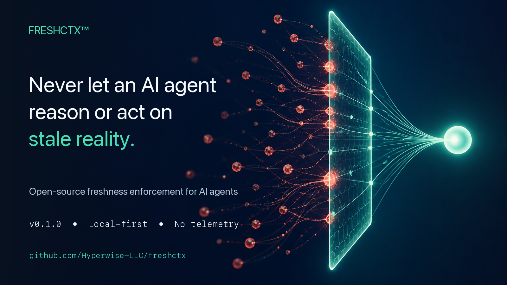

# FreshCtx™

**Stop AI agents from acting on reasoning that is no longer true.**

[](https://github.com/Hyperwise-LLC/freshctx/actions/workflows/ci.yml)
[](https://pypi.org/project/freshctx/)
[](https://www.python.org/)
[](LICENSE)
[](#local-audit-trail)



An agent can make the right decision from accurate information and still take the wrong action: the file, database row, API response, or MCP resource it relied on changed between **reasoning** and **execution**.

FreshCtx is an open-source Python runtime for closing that gap. It records the evidence behind a decision, revalidates the declared dependencies immediately before a protected action, and blocks or flags the action when the reasoning has become stale.

```text
observe evidence → reason from it → revalidate dependencies → act or block
```

- **Model- and framework-neutral** — wrap an existing agent instead of replacing it.
- **Local-first** — no account, hosted control plane, or telemetry.
- **Explicit and auditable** — you choose which evidence matters; FreshCtx records what was checked.
- **Useful beyond files** — adapters cover filesystem, Git, HTTP, Postgres, and safe MCP reads.

FreshCtx is Apache-2.0 software owned and stewarded by Hyperwise LLC as an independent open-source project.

## The failure mode

This is a time-of-check/time-of-use problem for agent reasoning:

1. An agent reads a deployment configuration and decides to deploy to staging.
2. The configuration changes to production while the agent is planning.
3. The agent executes the old staging decision against the new environment.

Prompting cannot reliably close this gap because the relevant state can change after the prompt has been evaluated. FreshCtx adds a freshness boundary immediately before the action.

## See it block stale reasoning

The smallest useful pattern is:

```python
from freshctx import guard, observe, reasoning

with guard(policy="block") as ctx:
    config = observe("config.yaml")

    with reasoning("choose_deployment_target", depends_on=[config]) as decision:
        target = choose_target(config)

    # Revalidates config and the dependent decision before agent.run executes.
    result = ctx.run(agent.run, target, depends_on=[decision])
```

If `config.yaml` changes before `ctx.run()`, FreshCtx marks the observation `STALE_SOURCE`, marks the decision `STALE_REASONING`, and raises `FreshnessBlocked` under the default blocking policy.

**Good first use cases:** deployment agents, coding agents, approval workflows, database-backed operations, browser agents, and MCP workflows that act on mutable resources.

[Read the API](API.md) · [Use the CLI](docs/CLI.md) · [Integrate frameworks](docs/INTEGRATIONS.md) · [Understand the security model](docs/SECURITY_MODEL.md) · [See the roadmap](BACKLOG.md) · [Ask a question](https://github.com/Hyperwise-LLC/freshctx/discussions)

For an independent control-versus-behavior test, run the
[JSONL assurance experiment](docs/OPSWATCH_ASSURANCE_EXPERIMENT.md). It produces
the normal FreshCtx audit stream and two bounded outcomes: a runner that respects
the block and a deliberately noncompliant runner that acts after the block.

## Quickstart

Prerequisites: Python 3.10–3.13. Git is required only by the Git adapter and its compatibility tests.

Install FreshCtx from PyPI and run the standalone stale-context demo:

```console
python -m venv .venv
source .venv/bin/activate
python -m pip install freshctx
python -m freshctx demo
```

On Windows PowerShell, activate the environment with `.\.venv\Scripts\Activate.ps1`; in Command Prompt, use `.venv\Scripts\activate.bat`.

Expected output includes:

```text
BLOCKED: STALE_REASONING
AUDIT EVENTS: 4
```

The installed-package demo requires no repository clone. The complete API pattern is deliberately small:

```python
from pathlib import Path
from tempfile import TemporaryDirectory

from freshctx import MemoryStore, guard, observe, reasoning


def deploy(target: str) -> None:
    print(f"DEPLOYED to {target}")


with TemporaryDirectory() as directory:
    root = Path(directory)
    config = root / "deployment.env"
    audit = root / "freshctx-audit.jsonl"
    config.write_text("TARGET=staging\n", encoding="utf-8")

    with guard(policy="block", store=MemoryStore(), audit_path=audit) as ctx:
        source = observe(config)
        with reasoning("choose_target", depends_on=[source]) as decision:
            target = "staging"
        ctx.run(deploy, target, depends_on=[decision])

    print(f"FreshCtx state: {ctx.result.state.value}")
    print(f"Audit events: {sum(1 for _ in audit.open(encoding='utf-8'))}")
```

### LangGraph

FreshCtx 0.6.0 includes synchronous and asynchronous LangGraph action-node wrappers. Install the optional integration dependency and run the controlled stale-state scenario:

```console
python -m pip install 'freshctx[langgraph]==0.6.0'
python examples/langgraph_stale_config.py
```

The LangGraph workflow deliberately changes a deployment configuration between planning and its action node. Expected output:

```text
BLOCKED: STALE_REASONING
```

The protected node uses the same framework-neutral boundary:

```python
from freshctx.integrations.langgraph import langgraph_action_node

def deploy_node(state):
    deploy(state["target"])
    return {"deployed": True}

protected_deploy = langgraph_action_node(
    deploy_node,
    depends_on=lambda state: [state["freshctx_decision"]],
    store=store,
    action_name="deploy",
    execution_id=lambda state: state.get("run_id"),
)
```

A stale or unverifiable dependency raises `FreshnessBlocked` before the node body starts. FreshCtx does not replace LangGraph routing, checkpointing, interrupts, retries, transactions, or idempotency.

### Agno

The optional Agno integration remains available in FreshCtx 0.6.0. Install the integration and run the model-free tool-hook scenario:

```console
python -m pip install 'freshctx[agno]==0.6.0'
python examples/agno_stale_tool.py
```

The example uses Agno's real tool execution chain. A deployment source changes after the decision is made, and the FreshCtx hook blocks the tool before its body runs. Attach the hook only to tools whose declared dependencies it protects:

```python
from freshctx.integrations.agno import agno_tool_hook

freshness_hook = agno_tool_hook(
    depends_on=[decision],
    store=store,
    audit_path="freshctx-agno-audit.jsonl",
)

@tool(tool_hooks=[freshness_hook])
def deploy(target: str) -> str:
    return f"deployed:{target}"
```

FreshCtx does not replace Agno's internal run-state, concurrency, transaction, or idempotency controls. This hook protects the external evidence explicitly declared by the application at the tool boundary.

### OpenAI Agents SDK

FreshCtx 0.7.0 maps the same pre-action contract to an OpenAI Agents SDK input guardrail for custom function tools:

```console
python -m pip install 'freshctx[openai-agents]==0.7.0'
python examples/openai_agents_stale_tool.py
```

```python
from agents import function_tool
from freshctx.integrations.openai_agents import openai_agents_tool_guardrail

freshness = openai_agents_tool_guardrail(
    depends_on=[decision],
    store=store,
    audit_path="freshctx-openai-agents-audit.jsonl",
)

@function_tool(tool_input_guardrails=[freshness])
async def deploy(target: str) -> str:
    """Deploy to the selected target."""
    return f"deployed:{target}"
```

Stale or unverifiable evidence triggers the SDK's native input-tool tripwire before the function-tool body starts. The FreshCtx result remains available as structured guardrail output. Tool arguments are not stored in FreshCtx integration metadata. This mapping applies to custom function tools; hosted tools, built-in execution tools, handoffs, and `Agent.as_tool()` are outside the SDK's tool-guardrail surface.

### Google Agent Development Kit

FreshCtx 0.8.0 maps the same pre-action contract to Google ADK's native `before_tool_callback` boundary:

```console
python -m pip install 'freshctx[google-adk]==0.8.0'
python examples/google_adk_stale_tool.py
```

```python
from freshctx.integrations.google_adk import google_adk_tool_callback

freshness = google_adk_tool_callback(
    depends_on=[decision],
    store=store,
    tool_names=["deploy"],
    audit_path="freshctx-google-adk-audit.jsonl",
)

agent = Agent(
    name="deployment_agent",
    model=model,
    tools=[deploy],
    before_tool_callback=freshness,
)
```

When evidence is current, the callback returns `None` and ADK runs the tool normally. When evidence is stale or unverifiable under the blocking policy, the callback returns a structured blocked response and ADK skips the tool body. The mapping supports synchronous and asynchronous function tools, correlates ADK's function-call ID, and does not copy tool arguments into FreshCtx metadata. Attach it only to named tools, or at agent level only when the same dependency set genuinely applies to every tool. Built-in tools that do not pass through the agent's before-tool callback are outside this boundary.

## Current implementation

The v0.8 runtime preserves the v0.1 `ObservationToken`, `ReasoningNode`, `CheckResult`, and `FreshnessStatus` behavior. A `ReasoningNode` carries its canonical, sorted, duplicate-free dependency identifiers; there is no separate public edge object.

The first v0.1 vertical slice includes:

- `ObservationToken` and `ReasoningNode` data models
- filesystem observation and validation
- Git repository- and path-scoped observation and validation
- transitive freshness evaluation
- `CURRENT`, `STALE_SOURCE`, `STALE_REASONING`, and `UNVERIFIABLE`
- default blocking policy plus `warn` and `allow`
- SQLite and in-memory stores
- local JSONL audit events
- Filesystem, Git, HTTP, Postgres, Stripe Subscription, and MCP adapters

Feedback-driven additions remain opt-in or additive:

- bounded concurrent validation through `validation_workers`
- total validation budgets that become `UNVERIFIABLE` when exceeded
- per-adapter and total-check timing evidence
- exact, version, fingerprint, TTL, attestation, and deliberately unverifiable evidence strategies
- `replan` and `require_approval` responses without new freshness states
- booking, voice-agent, and performance examples

Existing code remains synchronous unless concurrency is explicitly enabled. See `docs/PERFORMANCE.md`, `docs/FEEDBACK_VALIDATION_PLAN.md`, and `docs/ENTERPRISE_BOUNDARY.md`.

The following conceptual example shows where FreshCtx fits around an existing agent:

```python
from freshctx import guard, observe, reasoning

with guard(policy="block") as ctx:
    config = observe("config.yaml")
    with reasoning("deployment_target", depends_on=[config]) as decision:
        target = choose_target(config)
    result = ctx.run(agent.run, task, depends_on=[decision])
```

If `config.yaml` changes before the protected boundary, FreshCtx marks the observation `STALE_SOURCE`, the dependent decision `STALE_REASONING`, and raises `FreshnessBlocked`.

`ctx.run()` performs the freshness check and records the allow decision before it invokes the protected function. Use `ctx.protect()` only for output validation where no side effect has already occurred.

## Verify the checkout

```console
python -c "import freshctx; print(freshctx.FreshnessStatus.CURRENT.value)"
```

Run all three reference demos:

```bash
python examples/coding_file_drift.py
python examples/configuration_api_drift.py
python examples/audit_reasoning_drift.py
```

Expected final lines are `STALE_SOURCE`, `STALE_SOURCE`, and `only finding-a invalidated`, respectively.

Run the nine realistic business acceptance scenarios:

```bash
python examples/real_world_success_cases.py --output success-cases.json
```

The command covers banking, e-commerce, audit, insurance, healthcare operations,
procurement, customer service, IT/security, and legal operations. See
[`docs/SUCCESS_CASES.md`](docs/SUCCESS_CASES.md) for the method, results, and limits.

Run the complete test suite from an installed checkout:

```console
python -m pip install '.[test]'
python -m unittest discover -s tests -v
```

FreshCtx is licensed under Apache-2.0, model- and framework-neutral, local-first, and free of required accounts or telemetry.

## License & Commercial Use

FreshCtx is licensed under the [Apache License 2.0](LICENSE). You may use, modify, and distribute the software—including in commercial applications—subject to the license terms. No account, paid plan, or commercial agreement with Hyperwise LLC is required to use FreshCtx.

The software license does not grant permission to use the FreshCtx™ name, logo, or branding in a way that implies endorsement or creates confusion about the source of a modified product. See [TRADEMARKS.md](TRADEMARKS.md).

Hyperwise LLC may separately offer architecture, integration, deployment, managed connectors, organizational controls, and support services. These services are optional, are not required to use the open-source FreshCtx runtime, and remain separate from FreshCtx core. Possible future commercial products are not part of the v0.1 open-source project unless expressly released under its license.

## Why CI/CD is not enough

GitHub branch protection and CI/CD determine whether a particular commit passed its configured checks. FreshCtx determines whether the specific files, Git state, APIs, database rows, or MCP resources supporting an agent's current action are still valid when that action is about to occur.

FreshCtx does not replace GitHub, pull requests, branch protection, or CI/CD. It closes the reasoning-to-action freshness gap, including for mutable sources outside Git. Path-scoped Git validation prevents an unrelated repository change from invalidating every observation.

Memory systems can retain what an agent knew. FreshCtx is not memory: it checks whether reachable, declared evidence still matches its recorded fingerprint.

`CURRENT` proves only that every reachable, declared dependency was successfully revalidated as equivalent under its configured adapter at check time. It does not prove source truth, reasoning correctness, authorization, safety, compliance, or global reality. If a source cannot be checked, `UNVERIFIABLE` follows the configured policy and never silently becomes `CURRENT`.

See [`docs/FAQ.md`](docs/FAQ.md) for concise answers about CI/CD, memory, selective invalidation, compliance controls, and optional adapters.

## Local audit trail

Unless `audit_path` is supplied, FreshCtx appends JSON Lines events to `.freshctx/audit.jsonl`, relative to the process working directory. The file stays local; FreshCtx does not upload audit events or send telemetry.

Set an explicit location when the application has its own data directory:

```python
with guard(audit_path="var/audit/freshctx.jsonl") as ctx:
    ...
```

Each line is one event such as `observed`, `policy_applied`, or `action_allowed`. Treat audit files as application data: restrict access, define retention, and avoid putting them in source control.

SQLite records are written to `.freshctx/freshctx.db` unless a store path is supplied; SQLite may also create `-wal` and `-shm` companion files. Records and audit events can contain absolute local paths. To remove local FreshCtx data, stop every process using the store, then delete the database, its `-wal`/`-shm` companions, and the configured JSONL audit file. Deletion is irreversible; follow your application retention policy first.

## Adapter quick reference

All adapters use the same `observe()` entry point. Revalidation occurs when `ctx.check()`, `ctx.run()`, or a protected boundary evaluates the token or dependent reasoning.

The examples below assume:

```python
from freshctx import guard, observe
```

### Filesystem

```python
with guard(policy="allow") as ctx:
    token = observe("README.md", root=".")
    print(ctx.check(token).state.value)
```

The filesystem adapter streams file hashing and defaults to 16 MiB per file, 64 MiB total, and 10,000 traversed entries. Symlinks are fingerprinted without following them by default. If `follow_symlinks=True`, resolved file symlinks must remain inside `root`; directory symlink traversal is rejected as unsupported. Limit or boundary failures are `UNVERIFIABLE`, never `CURRENT`. Raw file contents are not stored, but absolute paths and safe fingerprint metadata are. Supply only trusted, intentionally scoped paths; FreshCtx does not secret-scan observed files.

### Git

```python
with guard(policy="allow") as ctx:
    token = observe(".", adapter="git", scope="path", path="README.md")
    print(ctx.check(token).state.value)
```

### HTTP

```python
with guard(policy="allow") as ctx:
    token = observe("https://example.com/", adapter="http", timeout=2.0)
    print(ctx.check(token).state.value)
```

Use a read-only endpoint. Authentication headers remain in process-local adapter state and should come from the application's secret store.

### Postgres

Install the optional dependency first:

```console
python -m pip install '.[postgres]'
```

For the current public package, use `python -m pip install 'freshctx[postgres]'`.

```python
import os

with guard(policy="allow") as ctx:
    token = observe(
        os.environ["DATABASE_URL"],
        adapter="postgres",
        query="SELECT id, status FROM jobs WHERE status = %s",
        params=["ready"],
        ordered=False,
        timeout=2.0,
    )
    print(ctx.check(token).state.value)
```

Postgres validation is read-only. DSNs, raw query text, and parameters are not persisted in observation tokens.

Postgres is an optional observed-source adapter, not a FreshCtx storage backend. Revalidation state such as credentials remains process-local; after restart, the application must reconstruct the configured adapter state or checks safely return `UNVERIFIABLE`.

### Stripe Subscription

Use the authoritative Stripe Subscription as a selected-field dependency instead of treating a webhook snapshot as current forever:

```python
import os

with guard(policy="block") as ctx:
    token = observe(
        "sub_123",
        adapter="stripe_subscription",
        api_key=os.environ["STRIPE_SECRET_KEY"],
        fields=("status", "customer", "cancel_at_period_end"),
        include_items=True,
        timeout=2.0,
    )
    print(ctx.check(token).state.value)
```

The adapter performs read-only `GET /v1/subscriptions/{id}` validation. API keys remain in process memory and are not written to observation tokens or audit events. Tokens contain selected field names and non-reversible fingerprints, not raw Stripe field values. A timeout, rate limit, authentication failure, malformed response, or missing runtime credential becomes `UNVERIFIABLE`; a missing previously observed Subscription is treated as changed. FreshCtx does not reconcile webhook delivery, perform payment retries, or provide idempotency. See `examples/stripe_subscription_drift.py` for a bounded no-network simulation.

### Research-document sources

A document workflow can model each named source as an observation and each claim as reasoning that declares only the sources it uses. When one source changes, FreshCtx can flag the dependent claims while unrelated claims remain current. `examples/document_source_drift.py` demonstrates the controlled mapping. `examples/live_document_source_validation.py` adds an opt-in live pattern: walled or inaccessible articles become `UNVERIFIABLE`, optional access headers remain process-local, and DOI records use selected Crossref metadata instead of publisher HTML. Both examples flag source movement without interpreting whether revised material still supports a claim. The live runner is an integration pattern above FreshCtx Core, not a managed research or truth-verification service.

### MCP

Pass a safe, read-only callable from the application's MCP client:

```python
def read_policy_resource():
    # Replace this body with the application's read-only MCP client call.
    return {"uri": "policy://deployment", "version": 1}


with guard(policy="allow") as ctx:
    token = observe(
        "policy-server",
        adapter="mcp",
        name="read_resource",
        arguments={"uri": "policy://deployment"},
        reader=read_policy_resource,
        safe=True,
    )
    print(ctx.check(token).state.value)
```

Unsafe or non-idempotent MCP operations are `UNVERIFIABLE`; do not use them as validation readers. See `docs/ADAPTER_CONTRACT.md` for the complete extension contract.

FreshCtx does not provide an MCP transport or client. The application supplies and reconstructs the safe-reader callback after process restart. External network calls occur only when the application explicitly selects an external adapter such as HTTP, Postgres, Stripe Subscription, or MCP.

## Project, support, and commercial inquiries

- FreshCtx product site: <https://freshctx.com> (the complete site is being developed separately)
- Source repository: <https://github.com/Hyperwise-LLC/freshctx>
- Hyperwise LLC corporate site: <https://hyperwise.io>
- Community support: see [`SUPPORT.md`](SUPPORT.md)

If FreshCtx is useful in your work, consider starring the repository so other developers can find it.

Community includes the complete Core runtime, six adapters, schemas, examples, and compatibility tests for local developer use. Using FreshCtx in a consequential or regulated workflow? Hyperwise LLC is working with design partners on organizational freshness controls, managed integrations, evidence, and deployment support. Contact `freshctx@hyperwise.io`. This does not announce a hosted service, control plane, enterprise edition, or SLA.

## Developer documentation

- `ARCHITECTURE.md` — components, data flow, trust boundaries, and extension model
- `API.md` — frozen v0.1 Python API contract
- `schemas/` — machine-readable v0.1 object contracts
- `adr/` — accepted architecture decisions
- `BACKLOG.md` — issue-ready implementation and release plan
- `PROJECT_STATUS.md` — implemented versus remaining work
- `SPEC.md` — normative, versioned v0.1 specification
- `docs/ADAPTER_CONTRACT.md` — adapter behavior and failure contract
- `docs/SECURITY_MODEL.md` — trust boundaries and fail-closed behavior
- `docs/PERFORMANCE.md` — intended scale and performance boundaries
- `docs/FAQ.md` — product boundaries and common implementation questions
- `GOVERNANCE.md` and `RELEASING.md` — stewardship and private-to-public release process

## Release checks

```console
python -m pip install '.[dev]'
python scripts/release_check.py
python -m build
```

The private-phase release workflow is manual and build-only. It tests the release, builds the wheel and source archive, verifies wheel installation, and stores private workflow artifacts. It contains no public publishing job.
